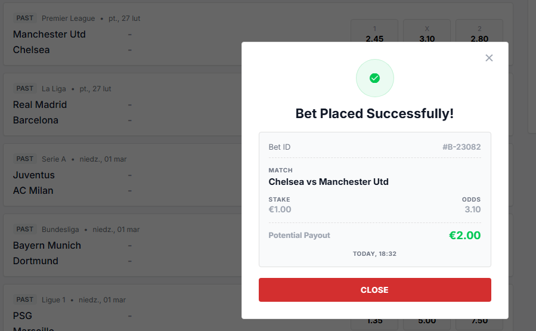
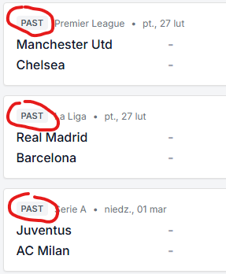
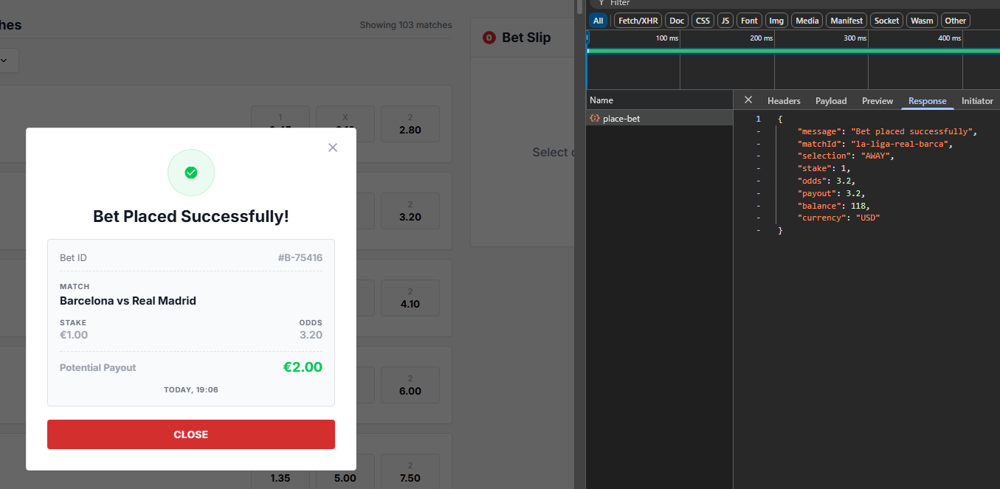
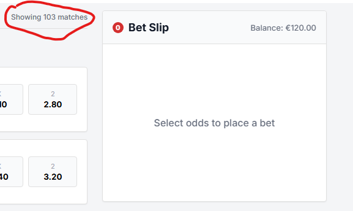
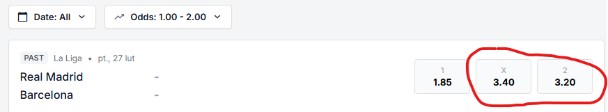

# Bug Report

**Bug ID:** BUG-01 
**Title:** Home and away team are mixed in bet summary  
**Severity:** Medium  

## Reproduction Steps
1. Authorize yourself and pick any football match
2. Pay attention who is Home and Away Team
3. Place successful bet
4. Check Home and Away Team in bet summary

## Expected Result
- Home and Away Team should be correct and match each other all the time

## Actual Result
- Home and Away Team are mixed in bet summary in compare with match avaialble in lobby

## Business Impact
- It might confuse player and additioanlly player could cancel bet or contact with support, even when bet is placed correctly.

## Evidence

---

**Bug ID:** BUG-02
**Title:** Past matches visible in match lobby 
**Severity:** High  

## Reproduction Steps
1. Authorize yourself and observe avaialble matches in lobby
2. Pay attention to date of the match

## Expected Result
- Upcoming matches only

## Actual Result
- Upcoming and Past matches visible

## Business Impact
- Very bad user experience, as we shoulnd't be able to bet on match in the past. Past matches reduce visiblity of Incoming matches.

## Evidence

---

**Bug ID:** BUG-03
**Title:** Player wallet balance may be negative by placing bet through API
**Severity:** Critical  

## Reproduction Steps
1. Set up player balance to 50 EUR
2. Use https://qae-assignment-tau.vercel.app/api/place-bet
3. Place bet higher than 50 EUR, but lower than 100 EUR
4. Bet is accepted

## Expected Result
- Bet should be cancelled, due to lack of funds after bet

## Actual Result
- Bet is accepted, player balance become negative

## Business Impact
- Critical situation that might generate big lose for company, because player balance could be negative.

## Evidence

---

**Bug ID:** BUG-04
**Title:** USD currency in backend resposne
**Severity:** Critical  

## Reproduction Steps
1. Authorize yourself and pick any football match
2. Open dev tools
3. Place successfull bet
4. Pay attention to currency in response

## Expected Result
- Currency is EUR

## Actual Result
- Currency is USD

## Business Impact
- This case could produce incorrect calculation once we convert EUR to USD. Front end works as expected as player seen EUR, backend use USD which is not in allign with documentation.

## Evidence

---

**Bug ID:** BUG-05
**Title:** Count of total matches is incorrect when using filter
**Severity:** Low  

## Reproduction Steps
1. Authorize yourself
2. Change date or range of date to show at least 2 matches

## Expected Result
- Count of total matches should be adjusted to the outcome

## Actual Result
- Count of total matches is not changeable

## Business Impact
- Bad user experience as we show incorrect value. It didn't have big impact on bet side.

## Evidence

---

**Bug ID:** BUG-06
**Title:** Count of total matches is incorrect when using filter
**Severity:** Low  

## Reproduction Steps
1. Authorize yourself
2. Change date or range of date to show at least 2 matches

## Expected Result
- Count of total matches should be adjusted to the outcome

## Actual Result
- Count of total matches is not changeable

## Business Impact
- Bad user experience as we show incorrect value. It didn't have big impact on bet side.

## Evidence

---

**Bug ID:** BUG-07
**Title:** Odds filtering show higher values
**Severity:** Medium  

## Reproduction Steps
1. Authorize yourself
2. Limit odds to 2 EUR

## Expected Result
- Odds filter supports min/max range (inclusive) and must reject invalid ranges with clearfeedback.

## Actual Result
- Odds could show higher value in compare value used in filtering

## Business Impact
- Bad user experience as we show incorrect value. It didn't have big impact on bet side.

## Evidence
